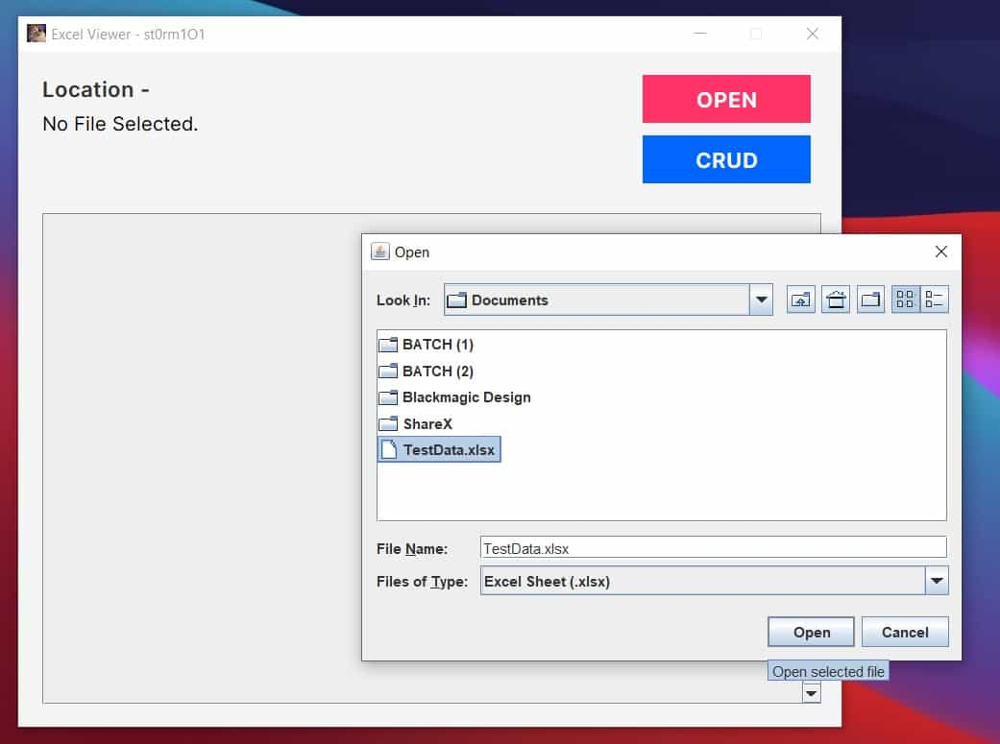
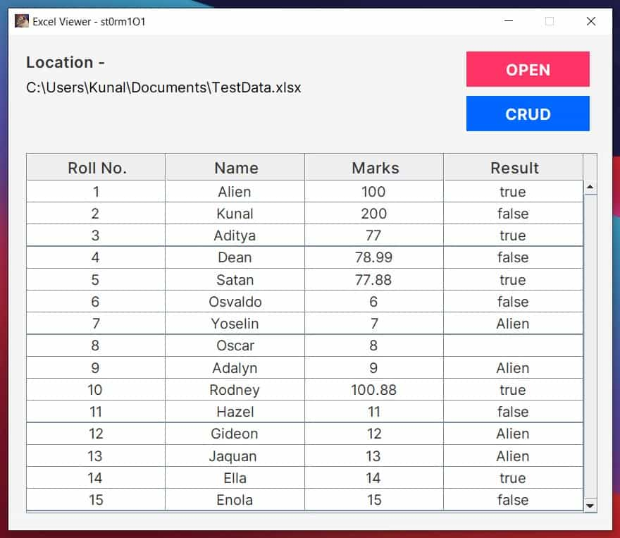
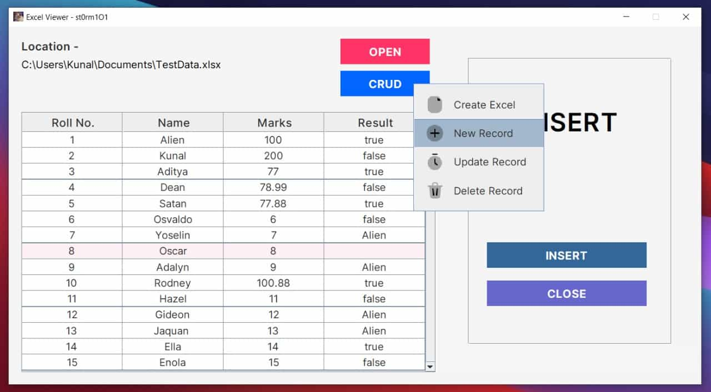
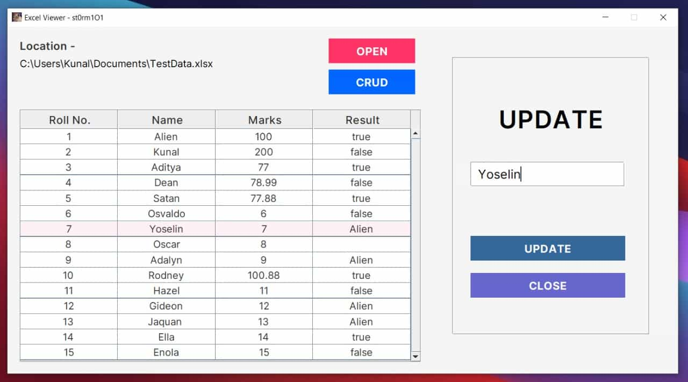

# Desktop-ExcelReader

## Overview
The **ExcelReader** is a Java Swing-based desktop utility that allows users to open, view, and manipulate Excel files (.xlsx). This application provides a user-friendly interface to perform CRUD (Create, Read, Update, Delete) operations on Excel sheets, specifically focusing on basic table management for data viewing and updating.

## Screenshots

Here’s a glimpse of what the application looks like:

## Features
- **Excel File Viewer**: Open and view the contents of Excel (.xlsx) files.
- **CRUD Operations**: Perform Create, Update, and Delete operations on Excel data.
- **Insertion**: Add new records at the top, bottom, left, or right of the selected data.
- **Error Handling**: Detect and notify the user about any errors or blank cells while reading Excel files.
- **Simple GUI**: Offers a clean, simple-to-use GUI for basic Excel file operations with real-time updates.

## Prerequisites
- **Java 17+**: Ensure Java 17 or above is installed on your system.
- **Maven**: Dependency management is done using Maven.
- **POI Library**: Apache POI is used to interact with Excel files.

## Application Layout
The application has a straightforward layout:
1. **File Operations**:
    - **OPEN**: Allows you to select and open an Excel file.
    - **CRUD**: Provides a dropdown menu for selecting Create, Update, or Delete operations on the opened file.
2. **Data Table**: Displays the content of the selected Excel file in a tabular format, with the first row as column headers.
3. **Operation Panel**:
    - The right panel allows you to perform specific operations (insert, update, or delete) based on the chosen action.
    - The input field is used for providing the data for updates.

## Usage

### 1. Open an Excel File
- Click the **OPEN** button to browse and select an `.xlsx` file.
- Once selected, the file path is displayed, and the content is loaded into the table for viewing.

### 2. Perform CRUD Operations
- **Create Excel**: Allows you to create a new Excel sheet.
- **Insert Record**: You can insert a new record at different positions (Top, Bottom, Left, Right) within the table.
- **Update Record**: Select a cell and modify its value by typing in the text field.
- **Delete Record**: Select a row and delete it from the table.

## Error Handling
- If no file is selected or an invalid action is performed, error messages are displayed using dialog boxes to help guide the user.

## Known Limitations
- Supports only `.xlsx` files.
- Limited to basic CRUD operations for simple data sets.

## Contribution
Contributions are welcome. Fork the repository and submit pull requests with your changes.

## License
This project is licensed under the GPL-3.0 License.

---